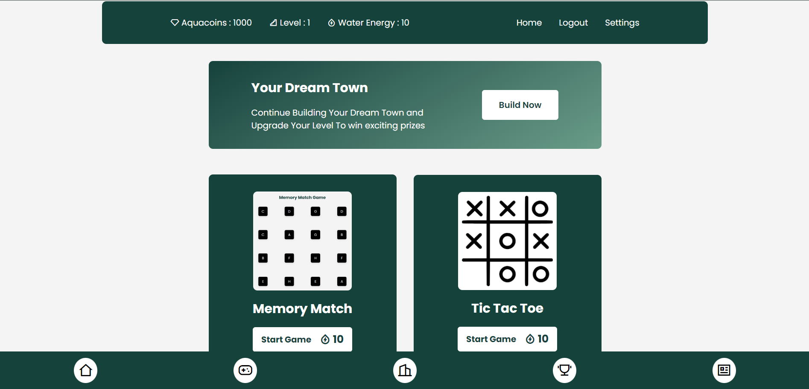

# Drip Drop - Groundwater Conservation Game


## Introduction

**Drip Drop** is an interactive storyline game focused on educating users about the importance of conserving groundwater. You take on the role of a villager responsible for implementing water-saving strategies to help your village survive drought. Play different games, earn aquacoins from them and Complete tasks, upgrade resources, and manage your water supply as you progress through the game.

## Features



- **Interactive Gameplay:** Engage in water conservation by completing tasks to build and upgrade your village.
- **Water Coins:** Earn and manage water coins to enhance village assets like water tanks and fields.
- **Quizzes & Events:** Participate in quizzes and events to earn extra rewards and level up.
- **User Levels:** Track your progress and unlock new features by leveling up.
- **Customizable Settings:** Personalize your game experience and reset your progress anytime.
- **Ads for Rewards:** Watch ads to gain additional water coins and boost your resources.

## Tech Stack

- **Frontend:** Ejs for dynamic and responsive fronted.
- **Backend:** Node.js, Express.js
- **Database:** MongoDB
- **Animations:** Three.js, GSAP in Upcoming Updates
- **Deployment:** [Deployed on your hosting platform if applicable]

## Getting Started

### Prerequisites

Ensure you have the following installed:

- Node.js (v14 or above)
- MongoDB or MongoDB Cloud Servers
- NPM or Yarn

### Installation

1. Clone the repository:

   ```bash
   git clone https://github.com/adityadhiman/drip-drop.git
   ```

2. Navigate into the project directory:

   ```bash
   cd your-repository-name
   ```

3. Install Dependencies
   ```
   npm i
   ```
4. Start the server
   ```
   node server.js or nodemon server.js
   ```

## Contributions

We welcome suggestions and contributions! To contribute, please follow these steps:

1. **Fork the Repository**
   - Click on the "Fork" button at the top right corner of the repository page to create your own copy of the repository.

2. **Clone Your Fork**
   - Clone your forked repository to your local machine:
     ```bash
     git clone https://github.com/your-username/drip-drop.git
     ```
   - Replace `your-username` with your GitHub username.

3. **Create a Branch**
   - Navigate into the project directory:
     ```bash
     cd drip-drop
     ```
   - Create a new branch for your feature or bug fix:
     ```bash
     git checkout -b your-branch-name
     ```

4. **Make Your Changes**
   - Implement your changes or fixes in the code.

5. **Commit Your Changes**
   - Add your changes to the staging area:
     ```bash
     git add .
     ```
   - Commit your changes with a descriptive message:
     ```bash
     git commit -m "Your descriptive commit message"
     ```

6. **Push to Your Fork**
   - Push your changes back to your forked repository:
     ```bash
     git push origin your-branch-name
     ```

7. **Create a Pull Request**
   - Go to the original repository on GitHub and click on the "New Pull Request" button.
   - Select your branch and provide a brief description of your changes.
   - Submit the pull request for review.

Thank you for contributing!

## Contact

Feel free to reach out if you have any questions or suggestions!

- [Website](https://adityadhiman.in)
- [GitHub](https://github.com/adityadhiman-in)
- [LinkedIn](https://www.linkedin.com/in/adityadhiman-in)

Made with ❤️ by [Aditya Dhiman](https://adityadhiman.in)
