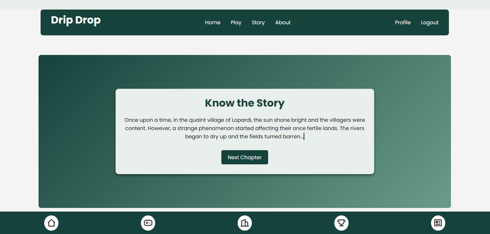

# Drip Drop - Groundwater Conservation Game



## Introduction

**Drip Drop** is an interactive storyline game focused on educating users about the importance of conserving groundwater. You take on the role of a villager responsible for implementing water-saving strategies to help your village survive drought. Play different games, earn aquacoins from them and Complete tasks, upgrade resources, and manage your water supply as you progress through the game.

## Features

- **Interactive Gameplay:** Engage in water conservation by completing tasks to build and upgrade your village.
- **Water Coins:** Earn and manage water coins to enhance village assets like water tanks and fields.
- **Quizzes & Events:** Participate in quizzes and events to earn extra rewards and level up.
- **User Levels:** Track your progress and unlock new features by leveling up.
- **Customizable Settings:** Personalize your game experience and reset your progress anytime.
- **Ads for Rewards:** Watch ads to gain additional water coins and boost your resources.

## Tech Stack

- **Frontend:** Ejs for dynamic and responsive fronted.
- **Backend:** Node.js, Express.js
- **Database:** MongoDB
- **Animations:** Three.js, GSAP in Upcoming Updates
- **Deployment:** [Deployed on your hosting platform if applicable]

## Getting Started

### Prerequisites

Ensure you have the following installed:

- Node.js (v14 or above)
- MongoDB or MongoDB Cloud Servers
- NPM or Yarn

### Installation

1. Clone the repository:

   ```bash
   git clone https://github.com/adityadhiman/drip-drop.git
   ```

2. Navigate into the project directory:

   ```bash
   cd your-repository-name
   ```

3. Install Dependencies
   ```
   npm i
   ```
4. Start the server
   ```
   node server.js or nodemon server.js
   ```

## Contact

Feel free to reach out if you have any questions or suggestions!

- [Website](https://adityadhiman.in)
- [GitHub](https://github.com/adityadhiman-in)
- [LinkedIn](https://www.linkedin.com/in/adityadhiman-in)

Made with ❤️ by [Aditya Dhiman](https://adityadhiman.in)
